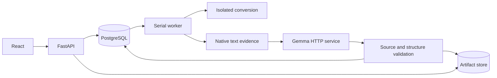

# Architecture

[Documentation](../README.md) · [Materials](materials.md) · [Assessment](learning.md)

## Data flow

Nginx proxies the same-origin /v1 API. The API owns authentication, read/write boundaries, and work creation. The worker handles conversion, analysis, review, and practice-set preparation. PostgreSQL stores state and metadata; files live under STUDYDY_DATA_DIR/artifacts.

No OCR runs in this edition. The semantic service has an independent lifecycle, and saved-content reads work while it is offline.

## Modules

| Location | Responsibility |
| --- | --- |
| [runtime/api](../backend/src/runtime/api/) | HTTP contracts, authentication, Origin checks, errors, and public projections |
| [document_normalization](../backend/src/document_normalization/) | Sandboxed conversion and source mappings |
| [pdf_evidence](../backend/src/pdf_evidence/) | Native extraction, evidence, and analysis |
| [knowledge_map](../backend/src/knowledge_map/) | Concepts, claims, relationships, review, and deterministic construction |
| [learning_adaptation](../backend/src/learning_adaptation/) | Sets, private answer keys, grading, progress, and guidance |
| [runtime/storage](../backend/src/runtime/storage/) | Persistence, migrations, integrity, and file recovery |
| [workers.py](../backend/src/runtime/workers.py) | Work claims, leases, execution, and recovery |
| [local_ai](../local_ai/) | Model execution contract |

## Model and validation boundaries

The model proposes concepts, claims, relationships, and question candidates. Code validates source identity, page/block bindings, technical literals, schemas, cycles, authorization, and answer privacy. Structured output establishes parseability, not correctness. Publication requires source binding and validation before calculating the final revision.

Only prerequisite edges influence the suggested learning order. Other relation types retain their meaning and direction; see [structure_rules.py](../backend/src/knowledge_map/structure_rules.py).

The [runtime lock](../local_ai/runtime-lock.json) defines model identity, packages, prompts, and budgets. Jobs and sets save their creation-time configuration. Deployment endpoints and credentials may change independently, but saved provenance is never rewritten.

Routine reads validate metadata; publication and actual file use verify bytes. A corrupt file blocks that use or a new publication without automatically deleting a saved map.

## Authorization and consistency

- Normalized email identifiers are unique. Passwords use randomly salted scrypt; see [learner_session.py](../backend/src/runtime/learner_session.py).
- HttpOnly session cookies and owner-scoped queries authorize access. Writes check Origin; private responses use private/no-store. UI identity hints grant no access.
- Logout retires the client and private views. Delayed responses cannot restore another account's data.
- Material/Study locks, versions, and unique constraints serialize changes. Leases and worker tokens reject stale publication.
- Progress and resume share one read snapshot; set submission is atomic.
- Staging, quarantine, and reconciliation coordinate database and filesystem commits.

The migration runner verifies the [SQL sequence](../backend/migrations/) and checksums, committing each schema change with its ledger entry. [OpenAPI](http://127.0.0.1:4177/v1/openapi.json) and [models.py](../backend/src/runtime/api/models.py) define the API.

Semantic generation uses the remaining 32K context after exact tokenization, up to the runtime lock ceiling. Input packing reserves at least 8K output tokens for analysis/review and 16K for assessment/checking (or a smaller explicitly configured ceiling). Validated analysis checkpoints can resume after budget-only changes; original run snapshots remain immutable. Truncation failures retain only task, finish reason, and token counts for diagnosis.
